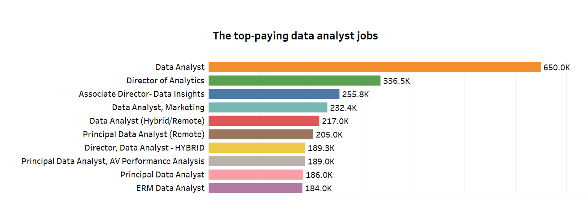

# Introduction
Dive into the data job market! Focusing on data analyst roles, this project explores salary, top paying jobs, in-demand skills, and 📈where high demand mees high salar in data analyst.
you can check the delatil here : [project](/project/)

# Tools I Used
For this SQL analysis, I am using several tools:

- **Visual Studio Code :** which I am using as my code editor.
- **PostgreSQL :** the DBMS I am using for this SQL analysis.
- **Tableau :** which I am using to display the visualization of this SQL code.

# The Analyst
In this analysis, I am examining several aspects:

### Top Paying Data Analyst Jobs
Identify the top 10 highest-paying Data Analyst roles that are available remotely, Focuses on job postings with specified salaries (remove nulls) and include company names of top 10 roles
```sql
SELECT	
	job_id,
	job_title,
	job_location,
	job_schedule_type,
	salary_year_avg,
	job_posted_date,
    name AS company_name
FROM
    job_postings_fact
LEFT JOIN company_dim ON job_postings_fact.company_id = company_dim.company_id
WHERE
    job_title_short = 'Data Analyst' AND 
    job_location = 'Anywhere' AND 
    salary_year_avg IS NOT NULL
ORDER BY
    salary_year_avg DESC
LIMIT 10;
```



### Top demanded skills for Data Analysts
```sql
SELECT
    skills,
    COUNT(skills) AS top_skills_demand
FROM job_postings_fact
INNER JOIN skills_job_dim
    ON skills_job_dim.job_id = job_postings_fact.job_id
INNER JOIN skills_dim
    ON skills_dim.skill_id = skills_job_dim.skill_id
WHERE job_title_short = 'Data Analyst'
GROUP BY
    skills
ORDER BY top_skills_demand DESC
LIMIT 5;
```


Here's breakdown of the most demanded skills for data analysts in 2023.
- ***SQL*** and ***Excel*** remain fundamental, emphasizing the need for strong fundamental skills in data processing and spreadsheet manipulation.
-  ***Programing** and ***Visualization Tools*** like ***Python, Tableau*** and ***Power BI*** are essential, pointing towards the increasing importance of technical skills in data stroytelling and decision support .

Donut chart of demand for top 5 skills in data analyst in job_postings

### Top paying skills for Data Analysts
Exploring the average salaries associated with different skills revealed which skills are the higest paying.

```sql
SELECT 
    skills,
    ROUND(AVG(salary_year_avg), 0) AS avg_salary
FROM job_postings_fact
INNER JOIN skills_job_dim ON job_postings_fact.job_id = skills_job_dim.job_id
INNER JOIN skills_dim ON skills_job_dim.skill_id = skills_dim.skill_id
WHERE
    job_title_short = 'Data Analyst'
    AND salary_year_avg IS NOT NULL
    AND job_work_from_home = True 
GROUP BY
    skills
ORDER BY
    avg_salary DESC
LIMIT 25;
```

Here's a breakdown of the results for top paying skills for Data Analysts:

- ***High Demand for Big Data & ML Skills:*** Top salaries are commanded by analysts skilled in big data technologies (PySpark, Couchbase), machine learning tools (DataRobot, Jupyter), and Python libraries (Pandas, Numpy), reflecting the industry's high valuation of data processing and predictive modeling capabilities.
- ***Software Development & Deployment Proficiency:*** Knowladge in development and deployment tools (GitLab, Kubernetes, Airflow) indicates a lucrative crossover between data analysts and engineering, with a premium on skills that facilitate automation and efficient data pipeline management.
- ***Cloud Computing Experties:*** Familiarity with cloud and data engineering tools (Elasticsearch, Databricks, GCP) underscores the growing importance of-cloud-based analytics environments, suggesting that cloud proficiency boots earing potential in data analytics.


## That is a summary of my project. If you want to see more, you can check out my project that I have mentioned above. thanks😉